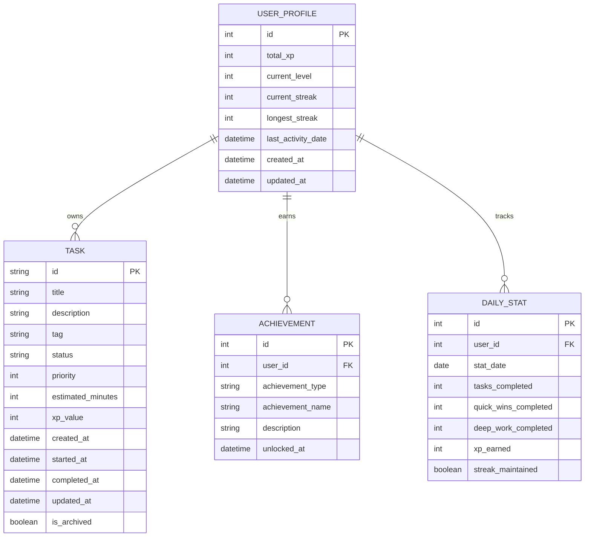

# Backlog, Gamification & Statistics Architecture

## Executive Summary

This document outlines the architecture for adding **persistence**, **backlog management**, **gamification**, and **statistics** features to the dofa.uno ADHD task management app. The design prioritizes ADHD-friendly principles: celebrating wins, avoiding overwhelm, and providing clear visual feedback.

**Key Additions:**
- SQLite database for persistent task storage
- Backlog system for completed tasks with timestamps
- XP/Level system with achievements and streaks
- Statistics dashboard with time-based analytics
- Backward-compatible API design

---

## Table of Contents

1. [Current State Analysis](#current-state-analysis)
2. [Data Models & Schema](#data-models--schema)
3. [Backend API Design](#backend-api-design)
4. [Frontend Architecture](#frontend-architecture)
5. [Gamification System](#gamification-system)
6. [Statistics & Analytics](#statistics--analytics)
7. [Implementation Strategy](#implementation-strategy)
8. [Technical Considerations](#technical-considerations)
9. [ADHD-Friendly Design Principles](#adhd-friendly-design-principles)

---

## Current State Analysis

### Existing Implementation

**Backend ([`main.py`](../backend/main.py)):**
- FastAPI with OpenAI integration
- No database (stateless)
- Two endpoints: `/api/parse_dump`, `/api/chat_intervention`
- Task model: `id`, `title`, `description`, `tag` (quick_win/deep_work), `status`, `priority`

**Frontend ([`App.jsx`](../frontend/src/App.jsx), [`Dashboard.jsx`](../frontend/src/components/Dashboard.jsx)):**
- React with local state management
- Tasks stored in component state (lost on refresh)
- Status toggle: todo ↔ done
- No persistence mechanism
- Mascot states: idle, focus, panic, triumph
- NeuroTunnel focus mode

### Key Constraints

1. **No Database:** Tasks are ephemeral
2. **No User System:** Single-user MVP
3. **Simple State:** Only todo/done status
4. **No History:** Completed tasks disappear
5. **No Metrics:** No tracking of progress over time

### What Needs to Change

1. ✅ Add SQLite database for persistence
2. ✅ Extend Task model with timestamps and completion data
3. ✅ Create User/Profile model for gamification state
4. ✅ Add backlog retrieval and search
5. ✅ Implement XP/level/achievement system
6. ✅ Build statistics aggregation
7. ✅ Update frontend to sync with backend

---

## Data Models & Schema

### Database Choice: SQLite

**Rationale:**
- Zero configuration, file-based
- Perfect for single-user MVP
- Easy to migrate to PostgreSQL later
- Built-in Python support via SQLAlchemy
- No additional infrastructure needed

### Schema Design



### SQLAlchemy Models

#### 1. UserProfile Model

```python
from sqlalchemy import Column, Integer, DateTime, String
from sqlalchemy.orm import relationship
from datetime import datetime
from database import Base

class UserProfile(Base):
    __tablename__ = "user_profiles"
    
    id = Column(Integer, primary_key=True, default=1)  # Single user MVP
    total_xp = Column(Integer, default=0, nullable=False)
    current_level = Column(Integer, default=1, nullable=False)
    current_streak = Column(Integer, default=0, nullable=False)
    longest_streak = Column(Integer, default=0, nullable=False)
    last_activity_date = Column(DateTime, nullable=True)
    created_at = Column(DateTime, default=datetime.utcnow, nullable=False)
    updated_at = Column(DateTime, default=datetime.utcnow, onupdate=datetime.utcnow)
    
    # Relationships
    tasks = relationship("Task", back_populates="user")
    achievements = relationship("Achievement", back_populates="user")
    daily_stats = relationship("DailyStat", back_populates="user")
    
    @property
    def xp_for_next_level(self):
        """Calculate XP needed for next level using exponential curve"""
        return 100 * (self.current_level ** 1.5)
    
    @property
    def xp_progress_percentage(self):
        """Calculate progress to next level as percentage"""
        xp_current_level = 100 * ((self.current_level - 1) ** 1.5)
        xp_in_current_level = self.total_xp - xp_current_level
        xp_needed = self.xp_for_next_level - xp_current_level
        return (xp_in_current_level / xp_needed) * 100 if xp_needed > 0 else 0
```

#### 2. Task Model (Enhanced)

```python
from sqlalchemy import Column, String, Integer, DateTime, Boolean, ForeignKey
from sqlalchemy.orm import relationship
from datetime import datetime
import uuid
from database import Base

class Task(Base):
    __tablename__ = "tasks"
    
    # Core fields
    id = Column(String, primary_key=True, default=lambda: str(uuid.uuid4()))
    user_id = Column(Integer, ForeignKey("user_profiles.id"), default=1)
    title = Column(String(500), nullable=False)
    description = Column(String(2000), nullable=True)
    tag = Column(String(50), nullable=False)  # 'quick_win' or 'deep_work'
    status = Column(String(50), default="todo", nullable=False)  # 'todo', 'done'
    priority = Column(Integer, nullable=True)
    
    # Time tracking
    estimated_minutes = Column(Integer, nullable=True)
    created_at = Column(DateTime, default=datetime.utcnow, nullable=False)
    started_at = Column(DateTime, nullable=True)
    completed_at = Column(DateTime, nullable=True)
    updated_at = Column(DateTime, default=datetime.utcnow, onupdate=datetime.utcnow)
    
    # Gamification
    xp_value = Column(Integer, nullable=False)  # Calculated on creation
    
    # Backlog management
    is_archived = Column(Boolean, default=False, nullable=False)
    
    # Relationships
    user = relationship("UserProfile", back_populates="tasks")
    
    def calculate_xp_value(self):
        """Calculate XP based on task type and estimated time"""
        base_xp = {
            'quick_win': 10,
            'deep_work': 25
        }
        xp = base_xp.get(self.tag, 10)
        
        # Bonus for priority tasks
        if self.priority and self.priority <= 2:
            xp = int(xp * 1.5)
        
        return xp
    
    @property
    def time_to_complete(self):
        """Calculate time taken to complete task in minutes"""
        if self.completed_at and self.started_at:
            delta = self.completed_at - self.started_at
            return int(delta.total_seconds() / 60)
        return None
```

#### 3. Achievement Model

```python
from sqlalchemy import Column, Integer, String, DateTime, ForeignKey
from sqlalchemy.orm import relationship
from datetime import datetime
from database import Base

class Achievement(Base):
    __tablename__ = "achievements"
    
    id = Column(Integer, primary_key=True, autoincrement=True)
    user_id = Column(Integer, ForeignKey("user_profiles.id"), nullable=False)
    achievement_type = Column(String(100), nullable=False)
    achievement_name = Column(String(200), nullable=False)
    description = Column(String(500), nullable=True)
    unlocked_at = Column(DateTime, default=datetime.utcnow, nullable=False)
    
    # Relationships
    user = relationship("UserProfile", back_populates="achievements")
```

#### 4. DailyStat Model

```python
from sqlalchemy import Column, Integer, Date, Boolean, ForeignKey
from sqlalchemy.orm import relationship
from datetime import date
from database import Base

class DailyStat(Base):
    __tablename__ = "daily_stats"
    
    id = Column(Integer, primary_key=True, autoincrement=True)
    user_id = Column(Integer, ForeignKey("user_profiles.id"), nullable=False)
    stat_date = Column(Date, default=date.today, nullable=False, unique=True)
    
    # Task counts
    tasks_completed = Column(Integer, default=0, nullable=False)
    quick_wins_completed = Column(Integer, default=0, nullable=False)
    deep_work_completed = Column(Integer, default=0, nullable=False)
    
    # XP tracking
    xp_earned = Column(Integer, default=0, nullable=False)
    
    # Streak tracking
    streak_maintained = Column(Boolean, default=False, nullable=False)
    
    # Relationships
    user = relationship("UserProfile", back_populates="daily_stats")
```

### Pydantic Schemas (API Models)

```python
from pydantic import BaseModel, Field
from typing import Optional, List
from datetime import datetime

# Task schemas
class TaskBase(BaseModel):
    title: str = Field(..., max_length=500)
    description: Optional[str] = Field(None, max_length=2000)
    tag: str = Field(..., pattern="^(quick_win|deep_work)$")
    priority: Optional[int] = Field(None, ge=1, le=5)

class TaskCreate(TaskBase):
    pass

class TaskUpdate(BaseModel):
    status: Optional[str] = Field(None, pattern="^(todo|done)$")
    started_at: Optional[datetime] = None
    completed_at: Optional[datetime] = None

class TaskResponse(TaskBase):
    id: str
    status: str
    estimated_minutes: Optional[int]
    xp_value: int
    created_at: datetime
    started_at: Optional[datetime]
    completed_at: Optional[datetime]
    is_archived: bool
    
    class Config:
        from_attributes = True

# User profile schemas
class UserProfileResponse(BaseModel):
    id: int
    total_xp: int
    current_level: int
    current_streak: int
    longest_streak: int
    xp_for_next_level: int
    xp_progress_percentage: float
    last_activity_date: Optional[datetime]
    
    class Config:
        from_attributes = True

# Achievement schemas
class AchievementResponse(BaseModel):
    id: int
    achievement_type: str
    achievement_name: str
    description: Optional[str]
    unlocked_at: datetime
    
    class Config:
        from_attributes = True

# Statistics schemas
class DailyStatResponse(BaseModel):
    stat_date: str  # ISO date string
    tasks_completed: int
    quick_wins_completed: int
    deep_work_completed: int
    xp_earned: int
    streak_maintained: bool
    
    class Config:
        from_attributes = True

class StatsSummaryResponse(BaseModel):
    total_tasks_completed: int
    total_quick_wins: int
    total_deep_work: int
    completion_rate_7d: float
    completion_rate_30d: float
    average_tasks_per_day: float
    most_productive_day: Optional[str]
    daily_stats: List[DailyStatResponse]
```

---

## Backend API Design

### Database Setup

**File: `backend/database.py`**

```python
from sqlalchemy import create_engine
from sqlalchemy.ext.declarative import declarative_base
from sqlalchemy.orm import sessionmaker
import os

DATABASE_URL = os.getenv("DATABASE_URL", "sqlite:///./dofa_uno.db")

engine = create_engine(
    DATABASE_URL,
    connect_args={"check_same_thread": False} if "sqlite" in DATABASE_URL else {}
)

SessionLocal = sessionmaker(autocommit=False, autoflush=False, bind=engine)

Base = declarative_base()

def get_db():
    """Dependency for FastAPI routes"""
    db = SessionLocal()
    try:
        yield db
    finally:
        db.close()

def init_db():
    """Initialize database and create tables"""
    Base.metadata.create_all(bind=engine)
    
    # Create default user profile if not exists
    db = SessionLocal()
    from models import UserProfile
    user = db.query(UserProfile).filter(UserProfile.id == 1).first()
    if not user:
        user = UserProfile(id=1)
        db.add(user)
        db.commit()
    db.close()
```

### API Endpoints

#### 1. Task Management Endpoints

**POST `/api/parse_dump`** (Enhanced)
```python
@app.post("/api/parse_dump", response_model=ParseResponse)
async def parse_dump(request: DumpRequest, db: Session = Depends(get_db)):
    """
    Parse unstructured text and create persistent tasks.
    Now saves tasks to database with XP values.
    """
    # Existing OpenAI parsing logic...
    tasks_data = await ai_service.parse_text(request.text)
    
    # Create and save tasks to database
    created_tasks = []
    for task_data in tasks_data:
        task = Task(
            title=task_data['title'],
            description=task_data.get('description'),
            tag=task_data['tag'],
            priority=task_data.get('priority'),
            estimated_minutes=15 if task_data['tag'] == 'quick_win' else 45
        )
        task.xp_value = task.calculate_xp_value()
        db.add(task)
        created_tasks.append(task)
    
    db.commit()
    
    return ParseResponse(tasks=[TaskResponse.from_orm(t) for t in created_tasks])
```

**GET `/api/tasks`** (New)
```python
@app.get("/api/tasks", response_model=TaskListResponse)
async def get_tasks(
    status: Optional[str] = None,
    tag: Optional[str] = None,
    include_archived: bool = False,
    db: Session = Depends(get_db)
):
    """
    Get all tasks with optional filtering.
    
    Query params:
    - status: Filter by 'todo' or 'done'
    - tag: Filter by 'quick_win' or 'deep_work'
    - include_archived: Include archived tasks (default: false)
    """
    query = db.query(Task).filter(Task.user_id == 1)
    
    if not include_archived:
        query = query.filter(Task.is_archived == False)
    
    if status:
        query = query.filter(Task.status == status)
    
    if tag:
        query = query.filter(Task.tag == tag)
    
    tasks = query.order_by(Task.created_at.desc()).all()
    
    return TaskListResponse(
        tasks=[TaskResponse.from_orm(t) for t in tasks],
        total_count=len(tasks)
    )
```

**PATCH `/api/tasks/{task_id}`** (New)
```python
@app.patch("/api/tasks/{task_id}", response_model=TaskUpdateResponse)
async def update_task(
    task_id: str,
    update: TaskUpdate,
    db: Session = Depends(get_db)
):
    """
    Update task status and timestamps.
    Handles XP award and streak updates on completion.
    """
    task = db.query(Task).filter(Task.id == task_id).first()
    if not task:
        raise HTTPException(status_code=404, detail="Task not found")
    
    # Update task fields
    if update.status:
        task.status = update.status
        
        # Handle completion
        if update.status == "done" and task.status != "done":
            task.completed_at = datetime.utcnow()
            
            # Award XP and update user profile
            user = db.query(UserProfile).filter(UserProfile.id == 1).first()
            user.total_xp += task.xp_value
            
            # Check for level up
            while user.total_xp >= user.xp_for_next_level:
                user.current_level += 1
            
            # Update streak
            today = date.today()
            if user.last_activity_date:
                days_diff = (today - user.last_activity_date.date()).days
                if days_diff == 1:
                    user.current_streak += 1
                elif days_diff > 1:
                    user.current_streak = 1
            else:
                user.current_streak = 1
            
            user.longest_streak = max(user.longest_streak, user.current_streak)
            user.last_activity_date = datetime.utcnow()
            
            # Update daily stats
            daily_stat = db.query(DailyStat).filter(
                DailyStat.user_id == 1,
                DailyStat.stat_date == today
            ).first()
            
            if not daily_stat:
                daily_stat = DailyStat(user_id=1, stat_date=today)
                db.add(daily_stat)
            
            daily_stat.tasks_completed += 1
            if task.tag == 'quick_win':
                daily_stat.quick_wins_completed += 1
            else:
                daily_stat.deep_work_completed += 1
            daily_stat.xp_earned += task.xp_value
            daily_stat.streak_maintained = True
            
            # Check for achievements
            new_achievements = check_achievements(user, db)
            
            db.commit()
            
            return TaskUpdateResponse(
                task=TaskResponse.from_orm(task),
                xp_awarded=task.xp_value,
                level_up=user.current_level > task.user.current_level,
                new_level=user.current_level,
                new_achievements=new_achievements,
                streak_updated=True,
                current_streak=user.current_streak
            )
    
    if update.started_at:
        task.started_at = update.started_at
    
    db.commit()
    
    return TaskUpdateResponse(task=TaskResponse.from_orm(task))
```

**DELETE `/api/tasks/{task_id}`** (New)
```python
@app.delete("/api/tasks/{task_id}")
async def delete_task(task_id: str, db: Session = Depends(get_db)):
    """
    Soft delete a task (archive it).
    """
    task = db.query(Task).filter(Task.id == task_id).first()
    if not task:
        raise HTTPException(status_code=404, detail="Task not found")
    
    task.is_archived = True
    db.commit()
    
    return {"message": "Task archived successfully"}
```

#### 2. Backlog Endpoints

**GET `/api/backlog`** (New)
```python
@app.get("/api/backlog", response_model=BacklogResponse)
async def get_backlog(
    limit: int = 50,
    offset: int = 0,
    tag: Optional[str] = None,
    search: Optional[str] = None,
    db: Session = Depends(get_db)
):
    """
    Get completed tasks (backlog) with pagination and search.
    
    Query params:
    - limit: Number of tasks to return (default: 50)
    - offset: Pagination offset (default: 0)
    - tag: Filter by task type
    - search: Search in title and description
    """
    query = db.query(Task).filter(
        Task.user_id == 1,
        Task.status == "done",
        Task.is_archived == False
    )
    
    if tag:
        query = query.filter(Task.tag == tag)
    
    if search:
        search_pattern = f"%{search}%"
        query = query.filter(
            (Task.title.ilike(search_pattern)) |
            (Task.description.ilike(search_pattern))
        )
    
    total_count = query.count()
    tasks = query.order_by(Task.completed_at.desc()).limit(limit).offset(offset).all()
    
    return BacklogResponse(
        tasks=[TaskResponse.from_orm(t) for t in tasks],
        total_count=total_count,
        limit=limit,
        offset=offset
    )
```

#### 3. Gamification Endpoints

**GET `/api/profile`** (New)
```python
@app.get("/api/profile", response_model=UserProfileResponse)
async def get_profile(db: Session = Depends(get_db)):
    """
    Get user profile with XP, level, and streak information.
    """
    user = db.query(UserProfile).filter(UserProfile.id == 1).first()
    if not user:
        raise HTTPException(status_code=404, detail="User profile not found")
    
    return UserProfileResponse.from_orm(user)
```

**GET `/api/achievements`** (New)
```python
@app.get("/api/achievements", response_model=AchievementsResponse)
async def get_achievements(db: Session = Depends(get_db)):
    """
    Get all unlocked achievements and available achievements.
    """
    user = db.query(UserProfile).filter(UserProfile.id == 1).first()
    unlocked = db.query(Achievement).filter(Achievement.user_id == 1).all()
    
    # Define all possible achievements
    all_achievements = get_all_achievement_definitions()
    
    # Mark which are unlocked
    unlocked_types = {a.achievement_type for a in unlocked}
    available = [a for a in all_achievements if a['type'] not in unlocked_types]
    
    return AchievementsResponse(
        unlocked=[AchievementResponse.from_orm(a) for a in unlocked],
        available=available,
        total_unlocked=len(unlocked),
        total_available=len(all_achievements)
    )
```

#### 4. Statistics Endpoints

**GET `/api/stats/summary`** (New)
```python
@app.get("/api/stats/summary", response_model=StatsSummaryResponse)
async def get_stats_summary(
    days: int = 30,
    db: Session = Depends(get_db)
):
    """
    Get statistics summary for the specified time period.
    
    Query params:
    - days: Number of days to include (default: 30)
    """
    user = db.query(UserProfile).filter(UserProfile.id == 1).first()
    
    # Get daily stats for period
    start_date = date.today() - timedelta(days=days)
    daily_stats = db.query(DailyStat).filter(
        DailyStat.user_id == 1,
        DailyStat.stat_date >= start_date
    ).order_by(DailyStat.stat_date.desc()).all()
    
    # Calculate aggregates
    total_tasks = sum(s.tasks_completed for s in daily_stats)
    total_quick_wins = sum(s.quick_wins_completed for s in daily_stats)
    total_deep_work = sum(s.deep_work_completed for s in daily_stats)
    
    # Completion rates
    days_with_tasks = len([s for s in daily_stats if s.tasks_completed > 0])
    completion_rate_7d = (days_with_tasks / min(7, days)) * 100 if days >= 7 else 0
    completion_rate_30d = (days_with_tasks / days) * 100
    
    # Average tasks per day
    avg_tasks = total_tasks / days if days > 0 else 0
    
    # Most productive day
    most_productive = max(daily_stats, key=lambda s: s.tasks_completed) if daily_stats else None
    
    return StatsSummaryResponse(
        total_tasks_completed=total_tasks,
        total_quick_wins=total_quick_wins,
        total_deep_work=total_deep_work,
        completion_rate_7d=round(completion_rate_7d, 1),
        completion_rate_30d=round(completion_rate_30d, 1),
        average_tasks_per_day=round(avg_tasks, 1),
        most_productive_day=most_productive.stat_date.isoformat() if most_productive else None,
        daily_stats=[DailyStatResponse.from_orm(s) for s in daily_stats]
    )
```

**GET `/api/stats/chart`** (New)
```python
@app.get("/api/stats/chart", response_model=ChartDataResponse)
async def get_chart_data(
    period: str = "week",  # week, month, year
    metric: str = "tasks",  # tasks, xp, streak
    db: Session = Depends(get_db)
):
    """
    Get data formatted for charts.
    
    Query params:
    - period: Time period (week, month, year)
    - metric: Metric to chart (tasks, xp, streak)
    """
    days_map = {"week": 7, "month": 30, "year": 365}
    days = days_map.get(period, 7)
    
    start_date = date.today() - timedelta(days=days)
    daily_stats = db.query(DailyStat).filter(
        DailyStat.user_id == 1,
        DailyStat.stat_date >= start_date
    ).order_by(DailyStat.stat_date.asc()).all()
    
    # Format data for charts
    labels = [s.stat_date.isoformat() for s in daily_stats]
    
    if metric == "tasks":
        data = [s.tasks_completed for s in daily_stats]
    elif metric == "xp":
        data = [s.xp_earned for s in daily_stats]
    else:  # streak
        # Calculate cumulative streak
        data = []
        current_streak = 0
        for s in daily_stats:
            if s.streak_maintained:
                current_streak += 1
            else:
                current_streak = 0
            data.append(current_streak)
    
    return ChartDataResponse(
        labels=labels,
        data=data,
        metric=metric,
        period=period
    )
```

### Achievement System Logic

**File: `backend/services/achievement_service.py`**

```python
from models import Achievement, UserProfile, Task
from sqlalchemy.orm import Session
from datetime import datetime, date, timedelta

ACHIEVEMENT_DEFINITIONS = [
    {
        "type": "first_task",
        "name": "First Steps",
        "description": "Complete your first task",
        "icon": "🎯"
    },
    {
        "type": "streak_3",
        "name": "Getting Started",
        "description": "Maintain a 3-day streak",
        "icon": "🔥"
    },
    {
        "type": "streak_7",
        "name": "Week Warrior",
        "description": "Maintain a 7-day streak",
        "icon": "⚡"
    },
    {
        "type": "streak_30",
        "name": "Monthly Master",
        "description": "Maintain a 30-day streak",
        "icon": "👑"
    },
    {
        "type": "quick_win_10",
        "name": "Quick Draw",
        "description": "Complete 10 quick wins",
        "icon": "⚡"
    },
    {
        "type": "deep_work_10",
        "name": "Deep Diver",
        "description": "Complete 10 deep work tasks",
        "icon": "🧠"
    },
    {
        "type": "level_5",
        "name": "Rising Star",
        "description": "Reach level 5",
        "icon": "⭐"
    },
    {
        "type": "level_10",
        "name": "Task Master",
        "description": "Reach level 10",
        "icon": "🌟"
    },
    {
        "type": "tasks_50",
        "name": "Half Century",
        "description": "Complete 50 tasks",
        "icon": "💯"
    },
    {
        "type": "tasks_100",
        "name": "Centurion",
        "description": "Complete 100 tasks",
        "icon": "🏆"
    },
    {
        "type": "perfect_day",
        "name": "Perfect Day",
        "description": "Complete 10 tasks in one day",
        "icon": "✨"
    },
    {
        "type": "early_bird",
        "name": "Early Bird",
        "description": "Complete a task before 9 AM",
        "icon": "🌅"
    },
    {
        "type": "night_owl",
        "name": "Night Owl",
        "description": "Complete a task after 10 PM",
        "icon": "🦉"
    }
]

def check_achievements(user: UserProfile, db: Session) -> list:
    """
    Check if user has unlocked any new achievements.
    Returns list of newly unlocked achievements.
    """
    new_achievements = []
    
    # Get existing achievements
    existing = {a.achievement_type for a in user.achievements}
    
    # Get task counts
    total_tasks = db.query(Task).filter(
        Task.user_id == user.id,
        Task.status == "done"
    ).count()
    
    quick_wins = db.query(Task).filter(
        Task.user_id == user.id,
        Task.status == "done",
        Task.tag == "quick_win"
    ).count()
    
    deep_work = db.query(Task).filter(
        Task.user_id == user.id,
        Task.status == "done",
        Task.tag == "deep_work"
    ).count()
    
    # Check each achievement condition
    checks = [
        ("first_task", total_tasks >= 1),
        ("streak_3", user.current_streak >= 3),
        ("streak_7", user.current_streak >= 7),
        ("streak_30", user.current_streak >= 30),
        ("quick_win_10", quick_wins >= 10),
        ("deep_work_10", deep_