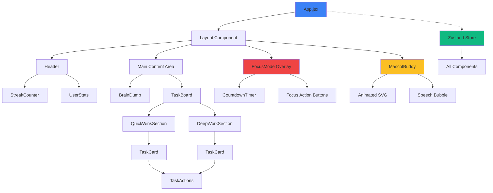
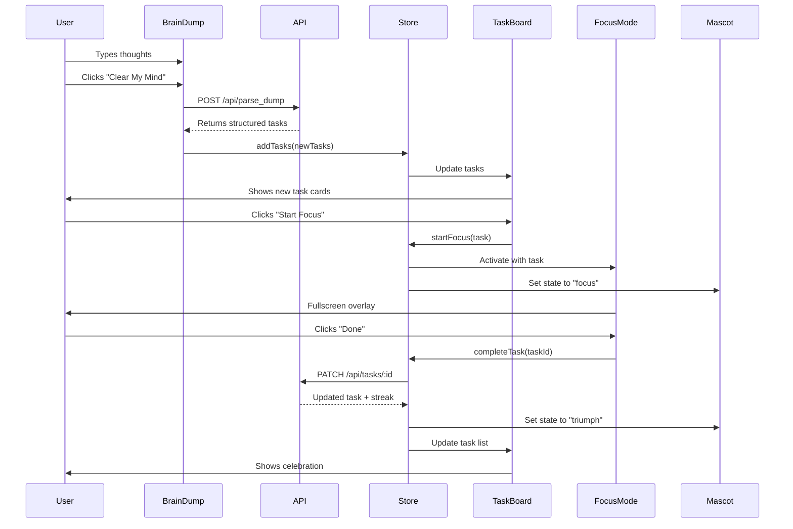

# Nemesis Frontend - Component Architecture

## Component Hierarchy



---

## Component Specifications

### 1. App.jsx
**Purpose:** Root component, global providers, routing logic

**Responsibilities:**
- Initialize Zustand store
- Fetch initial data on mount
- Handle global error boundary
- Manage focus mode state
- Render layout structure

**State:**
- None (uses Zustand)

**Props:**
- None

**Key Features:**
```jsx
function App() {
  const { fetchTasks, error } = useStore();
  
  useEffect(() => {
    fetchTasks(); // Load tasks on mount
  }, []);
  
  return (
    <ErrorBoundary>
      <div className="app-container">
        <Layout />
        <FocusMode /> {/* Conditional overlay */}
        <Gamification /> {/* Visual effects layer */}
      </div>
    </ErrorBoundary>
  );
}
```

---

### 2. BrainDump.jsx
**Purpose:** Text input for unstructured thought capture

**Props:**
```typescript
interface BrainDumpProps {
  onSubmit?: (tasks: Task[]) => void;
}
```

**State:**
```javascript
const [text, setText] = useState('');
const [isSubmitting, setIsSubmitting] = useState(false);
```

**UI Elements:**
- Large textarea (min-height: 200px)
- Character count (optional)
- Submit button with loading spinner
- Success animation on completion

**Behavior:**
1. User types thoughts
2. Click "Clear My Mind" button
3. Disable textarea, show loading
4. Call API `/api/parse_dump`
5. On success: clear text, show success message, animate new tasks
6. On error: show error message, keep text

**Accessibility:**
- Auto-focus on mount
- Keyboard shortcut (Cmd/Ctrl + Enter to submit)
- ARIA labels for screen readers

---

### 3. TaskBoard.jsx
**Purpose:** Container for task lists, organized by type

**Props:**
```typescript
interface TaskBoardProps {
  tasks: Task[];
}
```

**Layout:**
```
┌─────────────────────────────────────┐
│  Quick Wins (⚡)        [3 tasks]   │
│  ┌─────────────────────────────┐   │
│  │ Task Card 1                 │   │
│  └─────────────────────────────┘   │
│  ┌─────────────────────────────┐   │
│  │ Task Card 2                 │   │
│  └─────────────────────────────┘   │
├─────────────────────────────────────┤
│  Deep Work (🧠)         [2 tasks]   │
│  ┌─────────────────────────────┐   │
│  │ Task Card 3                 │   │
│  └─────────────────────────────┘   │
└─────────────────────────────────────┘
```

**Features:**
- Separate sections for Quick Wins and Deep Work
- Task count badges
- Empty state messages
- Drag-and-drop reordering (future enhancement)

---

### 4. TaskCard.jsx
**Purpose:** Individual task display with actions

**Props:**
```typescript
interface TaskCardProps {
  task: Task;
  onStart: (taskId: string) => void;
  onComplete: (taskId: string) => void;
  onDelete: (taskId: string) => void;
}
```

**UI Elements:**
```
┌─────────────────────────────────────┐
│ ⚡ Call mom                    [10m] │
│                                     │
│ [▶ Start Focus]  [✓]  [🗑]         │
└─────────────────────────────────────┘
```

**States:**
- **Pending:** Default appearance, all actions available
- **In Progress:** Highlighted border, pulsing animation
- **Completed:** Grayed out, strikethrough text, checkmark

**Animations:**
- Hover: Lift effect (translateY: -4px)
- Complete: Fade out + slide left
- Delete: Shrink and fade

**Actions:**
- **Start Focus:** Enter focus mode with this task
- **Complete:** Mark as done (quick action)
- **Delete:** Remove task

---

### 5. FocusMode.jsx
**Purpose:** Fullscreen immersive focus experience

**Props:**
```typescript
interface FocusModeProps {
  task: Task | null;
  isActive: boolean;
  onComplete: () => void;
  onPanic: () => void;
}
```

**Layout:**
```
┌─────────────────────────────────────┐
│                                     │
│                                     │
│         Finish the report           │
│                                     │
│              25:00                  │
│                                     │
│    [Done ✓]        [Panic 🆘]      │
│                                     │
│                                     │
└─────────────────────────────────────┘
```

**Features:**
- Fullscreen overlay (position: fixed, z-index: 9999)
- Dark gradient background
- Large task title (text-4xl)
- Countdown timer with progress ring
- Only 2 action buttons
- No close/exit button (intentional)
- Breathing animation on background
- Escape key disabled (forces commitment)

**Timer Logic:**
```javascript
const [timeLeft, setTimeLeft] = useState(task.estimated_time * 60);

useEffect(() => {
  const interval = setInterval(() => {
    setTimeLeft(prev => {
      if (prev <= 0) {
        clearInterval(interval);
        onComplete(); // Auto-complete when timer ends
        return 0;
      }
      return prev - 1;
    });
  }, 1000);
  
  return () => clearInterval(interval);
}, []);
```

**Panic Mode:**
- Shows intervention message from AI
- Offers to break task into smaller steps
- Option to exit focus mode

---

### 6. MascotBuddy.jsx
**Purpose:** Animated character providing emotional feedback

**Props:**
```typescript
interface MascotBuddyProps {
  state: 'idle' | 'focus' | 'panic' | 'triumph';
  message?: string;
}
```

**Visual Design:**
```
     ___
   /     \
  |  o o  |  <- Eyes (main emotion indicator)
  |   ^   |  <- Mouth
   \_____/
     | |
    /   \
```

**State Animations:**

**Idle:**
- Gentle breathing (scale: 1 → 1.05 → 1)
- Neutral expression
- Blue color (#3b82f6)
- Slow blink animation

**Focus:**
- Determined eyes (narrowed)
- Slight forward lean (rotate: 5deg)
- Green color (#10b981)
- Steady, no breathing

**Panic:**
- Wide eyes
- Worried mouth
- Red color (#ef4444)
- Shaking animation (translateX: -2px → 2px)

**Triumph:**
- Happy eyes (^_^)
- Big smile
- Gold color (#fbbf24)
- Jump animation + sparkle particles
- Celebration sound effect

**Position:**
- Fixed bottom-right corner
- Above other content (z-index: 100)
- Responsive: hide on mobile < 768px

**Speech Bubble:**
- Appears on state change
- Auto-dismiss after 3 seconds
- Encouraging messages:
  - Idle: "Ready when you are!"
  - Focus: "You've got this!"
  - Panic: "Take a breath. We'll figure it out."
  - Triumph: "Amazing work! 🎉"

---

### 7. Gamification.jsx
**Purpose:** Visual effects layer for dopamine hits

**Features:**

**Fog Overlay:**
```javascript
const fogOpacity = Math.min(pendingTasks.length * 0.1, 0.5);
```
- Increases with pending task count
- Clears as tasks are completed
- Subtle blur effect

**Chain Breaking Effect:**
- Particle explosion on task completion
- Uses canvas or CSS animations
- Confetti-like particles
- Sound effect (optional)

**Streak Display:**
```
🔥 5 Day Streak!
```
- Fire emoji grows with streak
- Milestone celebrations (5, 10, 25, 50, 100)
- Screen flash on milestone
- Persistent display in header

**Progress Visualization:**
```
[████████░░] 80% Complete
```
- Progress bar showing completed vs total
- Color changes based on progress
- Smooth transitions

---

### 8. CountdownTimer.jsx
**Purpose:** Visual timer for focus mode

**Props:**
```typescript
interface CountdownTimerProps {
  totalSeconds: number;
  onComplete: () => void;
}
```

**Display:**
```
    25:00
   ┌─────┐
   │ ███ │  <- Progress ring
   │ ███ │
   └─────┘
```

**Features:**
- Large numeric display (text-6xl)
- Circular progress ring (SVG)
- Color changes as time runs out:
  - Green: > 50% remaining
  - Yellow: 25-50% remaining
  - Red: < 25% remaining
- Pulsing animation in final minute
- Sound notification at 5 min, 1 min, 0 min

---

## State Management Flow

### Zustand Store Structure

```javascript
const useStore = create((set, get) => ({
  // ===== STATE =====
  tasks: [],
  currentTask: null,
  mascotState: 'idle',
  streak: 0,
  totalCompleted: 0,
  isLoading: false,
  error: null,
  isFocusMode: false,
  
  // ===== COMPUTED =====
  quickWins: () => get().tasks.filter(t => 
    t.type === 'quick_win' && t.status !== 'completed'
  ),
  deepWork: () => get().tasks.filter(t => 
    t.type === 'deep_work' && t.status !== 'completed'
  ),
  completedTasks: () => get().tasks.filter(t => 
    t.status === 'completed'
  ),
  
  // ===== ACTIONS =====
  
  // Fetch all tasks from API
  fetchTasks: async () => {
    set({ isLoading: true, error: null });
    try {
      const data = await api.getTasks();
      set({ 
        tasks: data.tasks,
        streak: data.user_state.streak,
        totalCompleted: data.user_state.total_completed,
        mascotState: data.user_state.mascot_state,
        isLoading: false
      });
    } catch (error) {
      set({ error: error.message, isLoading: false });
    }
  },
  
  // Parse brain dump and add tasks
  parseBrainDump: async (rawText) => {
    set({ isLoading: true, error: null });
    try {
      const data = await api.parseDump(rawText);
      set(state => ({ 
        tasks: [...state.tasks, ...data.tasks],
        isLoading: false
      }));
      return data.tasks;
    } catch (error) {
      set({ error: error.message, isLoading: false });
      return null;
    }
  },
  
  // Start focus mode with task
  startFocus: (task) => {
    set({ 
      currentTask: task,
      isFocusMode: true,
      mascotState: 'focus'
    });
    // Update task status to in_progress
    get().updateTaskStatus(task.id, 'in_progress');
  },
  
  // Complete current task
  completeTask: async (taskId) => {
    try {
      const data = await api.updateTask(taskId, { status: 'completed' });
      set(state => ({
        tasks: state.tasks.map(t => 
          t.id === taskId ? { ...t, status: 'completed' } : t
        ),
        streak: data.new_streak,
        totalCompleted: state.totalCompleted + 1,
        mascotState: 'triumph',
        isFocusMode: false,
        currentTask: null
      }));
      
      // Reset mascot after celebration
      setTimeout(() => {
        set({ mascotState: 'idle' });
      }, 3000);
    } catch (error) {
      set({ error: error.message });
    }
  },
  
  // Exit focus mode (panic)
  exitFocus: () => {
    const { currentTask } = get();
    if (currentTask) {
      // Revert task to pending
      get().updateTaskStatus(currentTask.id, 'pending');
    }
    set({ 
      isFocusMode: false,
      currentTask: null,
      mascotState: 'panic'
    });
    
    // Reset mascot after panic
    setTimeout(() => {
      set({ mascotState: 'idle' });
    }, 3000);
  },
  
  // Delete task
  deleteTask: async (taskId) => {
    try {
      await api.deleteTask(taskId);
      set(state => ({
        tasks: state.tasks.filter(t => t.id !== taskId)
      }));
    } catch (error) {
      set({ error: error.message });
    }
  },
  
  // Update task status
  updateTaskStatus: async (taskId, status) => {
    try {
      await api.updateTask(taskId, { status });
      set(state => ({
        tasks: state.tasks.map(t => 
          t.id === taskId ? { ...t, status } : t
        )
      }));
    } catch (error) {
      set({ error: error.message });
    }
  }
}));
```

---

## API Service Layer

### api.js

```javascript
const API_BASE_URL = import.meta.env.VITE_API_BASE_URL || 'http://localhost:8000';

class ApiService {
  async request(endpoint, options = {}) {
    try {
      const response = await fetch(`${API_BASE_URL}${endpoint}`, {
        headers: {
          'Content-Type': 'application/json',
          ...options.headers
        },
        ...options
      });
      
      if (!response.ok) {
        const error = await response.json();
        throw new Error(error.message || 'Request failed');
      }
      
      return await response.json();
    } catch (error) {
      console.error('API Error:', error);
      throw error;
    }
  }
  
  // Get all tasks
  async getTasks() {
    return this.request('/api/tasks');
  }
  
  // Parse brain dump
  async parseDump(rawText) {
    return this.request('/api/parse_dump', {
      method: 'POST',
      body: JSON.stringify({ raw_text: rawText })
    });
  }
  
  // Update task
  async updateTask(taskId, updates) {
    return this.request(`/api/tasks/${taskId}`, {
      method: 'PATCH',
      body: JSON.stringify(updates)
    });
  }
  
  // Delete task
  async deleteTask(taskId) {
    return this.request(`/api/tasks/${taskId}`, {
      method: 'DELETE'
    });
  }
  
  // Get AI intervention
  async getIntervention(taskId, context) {
    return this.request('/api/chat_intervention', {
      method: 'POST',
      body: JSON.stringify({ task_id: taskId, context })
    });
  }
}

export default new ApiService();
```

---

## User Flow Diagram



---

## Responsive Design Breakpoints

### Mobile (< 768px)
- Single column layout
- Hide mascot
- Simplified task cards
- Full-width brain dump
- Larger touch targets (min 48px)

### Tablet (768px - 1024px)
- Two column layout for tasks
- Show mascot (smaller)
- Side-by-side quick wins and deep work

### Desktop (> 1024px)
- Full layout with all features
- Large mascot in corner
- Spacious task cards
- Maximum content width: 1200px

---

## Animation Specifications

### Framer Motion Variants

```javascript
// Task card animations
export const taskCardVariants = {
  hidden: { opacity: 0, y: 20 },
  visible: { 
    opacity: 1, 
    y: 0,
    transition: { duration: 0.3, ease: 'easeOut' }
  },
  exit: { 
    opacity: 0, 
    x: -100,
    transition: { duration: 0.2 }
  }
};

// Focus mode overlay
export const focusModeVariants = {
  hidden: { opacity: 0, scale: 0.9 },
  visible: { 
    opacity: 1, 
    scale: 1,
    transition: { 
      type: 'spring', 
      damping: 20,
      stiffness: 300
    }
  },
  exit: { 
    opacity: 0, 
    scale: 0.9,
    transition: { duration: 0.2 }
  }
};

// Mascot state transitions
export const mascotVariants = {
  idle: { 
    scale: [1, 1.05, 1],
    transition: { 
      repeat: Infinity, 
      duration: 2,
      ease: 'easeInOut'
    }
  },
  focus: { 
    rotate: 5,
    scale: 1,
    transition: { duration: 0.3 }
  },
  panic: { 
    x: [-2, 2, -2, 2, 0],
    transition: { 
      repeat: 3, 
      duration: 0.1 
    }
  },
  triumph: { 
    y: [-20, 0],
    scale: [1, 1.2, 1],
    transition: { 
      duration: 0.5,
      ease: 'easeOut'
    }
  }
};
```

---

## Accessibility Features

### Keyboard Navigation
- Tab through all interactive elements
- Enter/Space to activate buttons
- Escape to close modals (except focus mode)
- Cmd/Ctrl + Enter to submit brain dump

### Screen Reader Support
- Semantic HTML (header, main, section, article)
- ARIA labels on all buttons
- ARIA live regions for dynamic content
- Alt text for mascot states

### Visual Accessibility
- High contrast text (WCAG AA compliant)
- Focus indicators on all interactive elements
- No reliance on color alone for information
- Reduced motion option (prefers-reduced-motion)

---

## Performance Optimization

### Code Splitting
```javascript
// Lazy load heavy components
const FocusMode = lazy(() => import('./components/FocusMode'));
const Gamification = lazy(() => import('./components/Gamification'));
```

### Memoization
```javascript
// Prevent unnecessary re-renders
const TaskCard = memo(({ task, onStart, onComplete, onDelete }) => {
  // Component logic
});

// Memoize expensive computations
const quickWins = useMemo(() => 
  tasks.filter(t => t.type === 'quick_win'),
  [tasks]
);
```

### Animation Performance
- Use `transform` and `opacity` only (GPU accelerated)
- Avoid animating `width`, `height`, `top`, `left`
- Use `will-change` sparingly
- Debounce rapid state changes

---

## Error Boundaries

```javascript
class ErrorBoundary extends Component {
  state = { hasError: false, error: null };
  
  static getDerivedStateFromError(error) {
    return { hasError: true, error };
  }
  
  componentDidCatch(error, errorInfo) {
    console.error('Error caught:', error, errorInfo);
  }
  
  render() {
    if (this.state.hasError) {
      return (
        <div className="error-screen">
          <h1>Something went wrong</h1>
          <p>Don't worry, your tasks are safe.</p>
          <button onClick={() => window.location.reload()}>
            Reload App
          </button>
        </div>
      );
    }
    
    return this.props.children;
  }
}
```

---

## Testing Checklist

### Component Tests
- [ ] BrainDump submits correctly
- [ ] TaskCard displays all states
- [ ] FocusMode timer counts down
- [ ] Mascot changes states
- [ ] Gamification effects trigger

### Integration Tests
- [ ] Brain dump → task creation flow
- [ ] Task completion → streak increment
- [ ] Focus mode → task status update
- [ ] Error handling → user feedback

### User Experience Tests
- [ ] All animations smooth (60fps)
- [ ] No layout shifts
- [ ] Fast initial load (< 2s)
- [ ] Responsive on all screen sizes
- [ ] Keyboard navigation works

---

This component architecture provides a clear blueprint for implementing the Nemesis frontend with all the ADHD-friendly features and dopamine-driven interactions specified in the requirements.
