# Nemesis MVP - Architecture & Implementation Plan

## Project Overview
**Nemesis** is an ADHD-friendly task management application designed to overcome Executive Dysfunction through psychology-first design, AI-powered task triage, and immersive focus modes.

**Timeline:** 4-day hackathon
**Priority:** Speed, Clean UI, Dopamine interactions, Robust error handling

---

## System Architecture

```mermaid
graph TB
    subgraph Frontend["Frontend (React + Vite)"]
        UI[User Interface]
        Store[Zustand Store]
        Components[React Components]
    end
    
    subgraph Backend["Backend (FastAPI)"]
        API[REST API]
        AI[OpenAI Integration]
        DB[(SQLite Database)]
    end
    
    UI --> Store
    Store --> Components
    Components --> API
    API --> AI
    API --> DB
    
    style Frontend fill:#1e293b
    style Backend fill:#0f172a
```



---

## Technology Stack

### Frontend
- **Framework:** React 18+ with Vite
- **Styling:** Tailwind CSS
- **Animations:** Framer Motion
- **Icons:** Lucide React
- **State Management:** Zustand
- **HTTP Client:** Axios or Fetch API

### Backend
- **Framework:** FastAPI
- **Database:** SQLite with SQLAlchemy ORM
- **AI:** OpenAI API (gpt-4o-mini)
- **Validation:** Pydantic
- **CORS:** FastAPI CORS middleware

---

## Project Structure

### Backend Structure
```
backend/
├── main.py                 # FastAPI app entry point
├── requirements.txt        # Python dependencies
├── .env                    # Environment variables (OpenAI API key)
├── database/
│   ├── __init__.py
│   ├── models.py          # SQLAlchemy models
│   ├── database.py        # Database connection
│   └── nemesis.db         # SQLite database file
├── api/
│   ├── __init__.py
│   ├── routes.py          # API endpoints
│   └── schemas.py         # Pydantic schemas
├── services/
│   ├── __init__.py
│   ├── ai_service.py      # OpenAI integration
│   └── task_service.py    # Task business logic
└── utils/
    ├── __init__.py
    └── helpers.py         # Utility functions
```

### Frontend Structure
```
frontend/
├── package.json
├── vite.config.js
├── tailwind.config.js
├── index.html
├── .env                   # API base URL
├── src/
│   ├── main.jsx          # App entry point
│   ├── App.jsx           # Root component
│   ├── store/
│   │   └── useStore.js   # Zustand store
│   ├── components/
│   │   ├── BrainDump.jsx        # RAM Cleaner component
│   │   ├── TaskList.jsx         # Task display
│   │   ├── FocusMode.jsx        # Neuro-Tunnel overlay
│   │   ├── MascotBuddy.jsx      # Animated mascot
│   │   ├── TaskCard.jsx         # Individual task
│   │   └── Gamification.jsx     # Visual effects
│   ├── services/
│   │   └── api.js        # API client
│   ├── hooks/
│   │   └── useTasks.js   # Custom hooks
│   ├── utils/
│   │   └── constants.js  # Constants and config
│   └── styles/
│       └── index.css     # Global styles
```

---

## Data Models

### Database Schema (SQLAlchemy)

```python
# Task Model
class Task(Base):
    id: UUID (Primary Key)
    title: String(500)
    type: Enum('quick_win', 'deep_work')
    status: Enum('pending', 'in_progress', 'completed')
    estimated_time: Integer  # minutes
    created_at: DateTime
    completed_at: DateTime (nullable)
    raw_input: Text (nullable)  # Original brain dump text
```

```python
# UserState Model (Single row for MVP)
class UserState(Base):
    id: Integer (Primary Key, always 1)
    mascot_state: Enum('idle', 'focus', 'panic', 'triumph')
    streak: Integer (default 0)
    total_completed: Integer (default 0)
    last_activity: DateTime
```

### TypeScript Interfaces (Frontend)

```typescript
interface Task {
  id: string;
  title: string;
  type: 'quick_win' | 'deep_work';
  status: 'pending' | 'in_progress' | 'completed';
  estimated_time: number;
  created_at: string;
  completed_at?: string;
}

interface UserState {
  tasks: Task[];
  currentTask: Task | null;
  mascotState: 'idle' | 'focus' | 'panic' | 'triumph';
  streak: number;
}

interface BrainDumpResponse {
  tasks: Task[];
  message: string;
}

interface ChatInterventionResponse {
  message: string;
  suggestions?: string[];
}
```

---

## API Endpoints

### Backend Routes

#### 1. Parse Brain Dump
```
POST /api/parse_dump
Content-Type: application/json

Request:
{
  "raw_text": "I need to finish the report, call mom, and fix that bug"
}

Response:
{
  "tasks": [
    {
      "id": "uuid-1",
      "title": "Finish the report",
      "type": "deep_work",
      "status": "pending",
      "estimated_time": 45,
      "created_at": "2026-01-07T13:00:00Z"
    },
    {
      "id": "uuid-2",
      "title": "Call mom",
      "type": "quick_win",
      "status": "pending",
      "estimated_time": 10,
      "created_at": "2026-01-07T13:00:00Z"
    }
  ],
  "message": "I've organized your thoughts into 2 tasks!"
}
```

#### 2. Chat Intervention
```
POST /api/chat_intervention
Content-Type: application/json

Request:
{
  "task_id": "uuid-1",
  "context": "feeling overwhelmed"
}

Response:
{
  "message": "Let's break this down into smaller steps...",
  "suggestions": [
    "Start with just the introduction",
    "Set a 15-minute timer",
    "Take a 5-minute break first"
  ]
}
```

#### 3. Get All Tasks
```
GET /api/tasks

Response:
{
  "tasks": [...],
  "user_state": {
    "mascot_state": "idle",
    "streak": 3,
    "total_completed": 15
  }
}
```

#### 4. Update Task Status
```
PATCH /api/tasks/{task_id}
Content-Type: application/json

Request:
{
  "status": "completed"
}

Response:
{
  "task": {...},
  "streak_updated": true,
  "new_streak": 4
}
```

#### 5. Delete Task
```
DELETE /api/tasks/{task_id}

Response:
{
  "message": "Task deleted successfully"
}
```

---

## Core Features Implementation

### 1. RAM Cleaner (Brain Dump)

**Component:** [`BrainDump.jsx`](frontend/src/components/BrainDump.jsx)

**Features:**
- Large, distraction-free text area
- Auto-expanding height
- Placeholder with encouraging text
- Submit button with loading state
- Immediate visual feedback on submission

**Flow:**
1. User types unstructured thoughts
2. Click "Clear My Mind" button
3. Text sent to `/api/parse_dump`
4. AI parses and returns structured tasks
5. Tasks appear in task list with animation
6. Text area clears with success animation

---

### 2. AI Triage System

**Service:** [`ai_service.py`](backend/services/ai_service.py)

**Logic:**
- Use OpenAI GPT-4o-mini with structured prompt
- Parse natural language into task objects
- Classify based on:
  - Time estimate (< 15 min = quick_win)
  - Complexity keywords (research, write, build = deep_work)
  - Action verbs (call, email, check = quick_win)

**Prompt Template:**
```
You are a task parser for people with ADHD. Parse this brain dump into structured tasks.

Rules:
- Extract clear, actionable tasks
- Estimate time in minutes
- Classify as "quick_win" (<15 min) or "deep_work" (>15 min)
- Ignore non-actionable thoughts
- Be encouraging and supportive

Brain dump: {raw_text}

Return JSON array of tasks.
```

---

### 3. Neuro-Tunnel (Focus Mode)

**Component:** [`FocusMode.jsx`](frontend/src/components/FocusMode.jsx)

**Features:**
- Fullscreen overlay (z-index: 9999)
- Dark background with subtle gradient
- Large task title (3xl font)
- Countdown timer (visual + numeric)
- Only 2 buttons: "Done" (green) and "Panic" (red)
- No close/exit button (forces commitment)
- Breathing animation on background
- Sound effects on completion (optional)

**Animations:**
- Fade in with scale effect
- Pulsing border around task
- Timer progress ring
- Celebration confetti on "Done"
- Gentle shake on "Panic"

---

### 4. Mascot Buddy

**Component:** [`MascotBuddy.jsx`](frontend/src/components/MascotBuddy.jsx)

**States:**
- **Idle:** Gentle breathing animation, neutral expression
- **Focus:** Determined look, slight forward lean
- **Panic:** Worried expression, shaking slightly
- **Triumph:** Celebration pose, sparkles

**Implementation:**
- SVG-based character (simple geometric shapes)
- Framer Motion for state transitions
- Positioned in bottom-right corner
- Responds to user actions in real-time
- Optional speech bubbles with encouragement

**Visual Design:**
- Simple blob/creature shape
- Expressive eyes (main emotion indicator)
- Color shifts with state (blue → green → red → gold)
- Particle effects on triumph

---

### 5. Gamification System

**Component:** [`Gamification.jsx`](frontend/src/components/Gamification.jsx)

**Visual Metaphors:**
- **Fog:** Overlays screen when many pending tasks (opacity based on count)
- **Chains:** Visual elements around task cards
- **Breaking Effect:** Particle explosion when task completed
- **Streak Counter:** Fire emoji + number, grows with streak
- **Progress Bar:** Visual representation of completed vs pending

**Micro-interactions:**
- Task card hover: Lift effect
- Task completion: Checkmark animation + sound
- Streak milestone: Screen flash + mascot celebration
- Empty state: Encouraging message with animation

---

## State Management (Zustand)

**Store Structure:**
```javascript
const useStore = create((set) => ({
  // State
  tasks: [],
  currentTask: null,
  mascotState: 'idle',
  streak: 0,
  isLoading: false,
  error: null,
  isFocusMode: false,
  
  // Actions
  setTasks: (tasks) => set({ tasks }),
  addTasks: (newTasks) => set((state) => ({ 
    tasks: [...state.tasks, ...newTasks] 
  })),
  updateTask: (taskId, updates) => set((state) => ({
    tasks: state.tasks.map(t => 
      t.id === taskId ? { ...t, ...updates } : t
    )
  })),
  deleteTask: (taskId) => set((state) => ({
    tasks: state.tasks.filter(t => t.id !== taskId)
  })),
  setCurrentTask: (task) => set({ currentTask: task }),
  setMascotState: (state) => set({ mascotState: state }),
  incrementStreak: () => set((state) => ({ 
    streak: state.streak + 1 
  })),
  resetStreak: () => set({ streak: 0 }),
  enterFocusMode: (task) => set({ 
    isFocusMode: true, 
    currentTask: task,
    mascotState: 'focus'
  }),
  exitFocusMode: () => set({ 
    isFocusMode: false, 
    currentTask: null,
    mascotState: 'idle'
  }),
  setLoading: (isLoading) => set({ isLoading }),
  setError: (error) => set({ error })
}));
```

---

## Design System

### Color Palette
```css
/* Primary Background */
--bg-primary: #0f172a;      /* Deep dark blue */
--bg-secondary: #1e293b;    /* Slightly lighter */
--bg-tertiary: #334155;     /* Card backgrounds */

/* Accent Colors */
--accent-green: #10b981;    /* Success, Quick Wins */
--accent-blue: #3b82f6;     /* Deep Work */
--accent-red: #ef4444;      /* Panic, Delete */
--accent-gold: #fbbf24;     /* Triumph, Streak */

/* Text */
--text-primary: #f1f5f9;    /* Main text */
--text-secondary: #94a3b8;  /* Subtle text */
--text-muted: #64748b;      /* Placeholders */
```

### Typography
```css
/* Headings */
h1: 3xl (30px), font-bold, tracking-tight
h2: 2xl (24px), font-semibold
h3: xl (20px), font-medium

/* Body */
body: base (16px), font-normal, leading-relaxed
small: sm (14px)

/* Focus Mode */
task-title: 4xl (36px), font-bold, leading-tight
```

### Spacing & Layout
- Generous padding (minimum 1rem)
- Large click targets (minimum 44px)
- Clear visual hierarchy
- Maximum content width: 1200px
- Centered layouts

### Animation Principles
- **Duration:** 200-300ms for micro-interactions
- **Easing:** ease-out for entrances, ease-in for exits
- **Feedback:** Every action has visual response
- **Smoothness:** 60fps animations (use transform/opacity)

---

## Error Handling Strategy

### Frontend
```javascript
// API call wrapper with error handling
async function apiCall(endpoint, options) {
  try {
    const response = await fetch(endpoint, options);
    if (!response.ok) {
      throw new Error(`HTTP ${response.status}`);
    }
    return await response.json();
  } catch (error) {
    // Show user-friendly error
    useStore.getState().setError(
      'Something went wrong. Please try again.'
    );
    // Log for debugging
    console.error('API Error:', error);
    return null;
  }
}
```

### Backend
```python
# Global exception handler
@app.exception_handler(Exception)
async def global_exception_handler(request, exc):
    return JSONResponse(
        status_code=500,
        content={
            "message": "An error occurred. Please try again.",
            "detail": str(exc) if DEBUG else None
        }
    )

# Specific error handling
@app.post("/api/parse_dump")
async def parse_dump(data: BrainDumpRequest):
    try:
        tasks = await ai_service.parse_text(data.raw_text)
        return {"tasks": tasks, "message": "Success!"}
    except OpenAIError as e:
        raise HTTPException(
            status_code=503,
            detail="AI service temporarily unavailable"
        )
    except Exception as e:
        logger.error(f"Parse error: {e}")
        raise HTTPException(
            status_code=500,
            detail="Failed to parse tasks"
        )
```

### User-Facing Error Messages
- **Network Error:** "Can't reach the server. Check your connection."
- **AI Error:** "AI is taking a break. Try again in a moment."
- **Validation Error:** "Please enter some text to organize."
- **Generic Error:** "Something went wrong. Your data is safe."

---

## Development Workflow

### Phase 1: Foundation Setup
1. Initialize backend with FastAPI boilerplate
2. Set up SQLite database and models
3. Initialize frontend with Vite + React
4. Configure Tailwind CSS and Framer Motion
5. Set up environment variables

### Phase 2: Backend Core
1. Implement database models and migrations
2. Create API endpoints (parse_dump, tasks CRUD)
3. Integrate OpenAI API with error handling
4. Test endpoints with Postman/curl

### Phase 3: Frontend Core
1. Set up Zustand store
2. Create API service layer
3. Build BrainDump component
4. Build TaskList and TaskCard components
5. Connect to backend API

### Phase 4: Advanced Features
1. Implement Focus Mode overlay
2. Create Mascot Buddy with animations
3. Add gamification visual effects
4. Implement streak tracking

### Phase 5: Polish & Testing
1. Add loading states and error handling
2. Refine animations and micro-interactions
3. Test complete user flow
4. Fix bugs and edge cases
5. Optimize performance

---

## Testing Strategy

### Manual Testing Checklist
- [ ] Brain dump with various text formats
- [ ] Task creation and display
- [ ] Task status updates (pending → in_progress → completed)
- [ ] Focus mode entry and exit
- [ ] Mascot state changes
- [ ] Streak increment on task completion
- [ ] Error handling (network failure, invalid input)
- [ ] UI responsiveness on different screen sizes
- [ ] Animation smoothness
- [ ] Dark theme consistency

### Edge Cases
- Empty brain dump submission
- Very long task titles
- Rapid task completion (streak testing)
- API timeout scenarios
- Browser refresh (state persistence)

---

## Deployment Considerations

### Backend
- Use `uvicorn` for ASGI server
- Set CORS to allow frontend origin
- Store OpenAI API key in environment variable
- SQLite file in persistent directory

### Frontend
- Build with `npm run build`
- Serve static files with any web server
- Configure API base URL via environment variable

### Environment Variables

**Backend (.env):**
```
OPENAI_API_KEY=sk-...
DATABASE_URL=sqlite:///./database/nemesis.db
CORS_ORIGINS=http://localhost:5173
DEBUG=True
```

**Frontend (.env):**
```
VITE_API_BASE_URL=http://localhost:8000
```

---

## Success Metrics

### MVP Completion Criteria
- ✅ User can dump thoughts and get structured tasks
- ✅ Tasks are categorized into Quick Wins and Deep Work
- ✅ Focus Mode provides immersive single-task experience
- ✅ Mascot responds to user actions
- ✅ Visual feedback on every interaction
- ✅ Streak tracking works correctly
- ✅ Error handling prevents crashes
- ✅ UI is clean, dark, and ADHD-friendly

### User Experience Goals
- **Time to First Task:** < 30 seconds from opening app
- **Cognitive Load:** Minimal decisions required
- **Dopamine Hits:** Frequent positive feedback
- **Focus Retention:** No distracting elements in Focus Mode

---

## Future Enhancements (Post-MVP)

- Task scheduling and reminders
- Pomodoro timer integration
- Task history and analytics
- Multiple user support with authentication
- Mobile app (React Native)
- Voice input for brain dumps
- Customizable mascot characters
- Social features (accountability partners)
- Integration with calendar apps
- Offline mode with sync

---

## Key Implementation Notes

### OpenAI Integration Best Practices
```python
# Use structured output for reliability
response = openai.ChatCompletion.create(
    model="gpt-4o-mini",
    messages=[
        {"role": "system", "content": SYSTEM_PROMPT},
        {"role": "user", "content": user_input}
    ],
    temperature=0.7,
    max_tokens=500,
    response_format={"type": "json_object"}  # Force JSON
)
```

### Framer Motion Animation Examples
```jsx
// Task card entrance
<motion.div
  initial={{ opacity: 0, y: 20 }}
  animate={{ opacity: 1, y: 0 }}
  exit={{ opacity: 0, x: -100 }}
  transition={{ duration: 0.3 }}
>
  <TaskCard />
</motion.div>

// Focus mode overlay
<motion.div
  initial={{ opacity: 0, scale: 0.9 }}
  animate={{ opacity: 1, scale: 1 }}
  exit={{ opacity: 0, scale: 0.9 }}
  transition={{ type: "spring", damping: 20 }}
>
  <FocusMode />
</motion.div>
```

### Zustand Persistence (Optional)
```javascript
import { persist } from 'zustand/middleware';

const useStore = create(
  persist(
    (set) => ({
      // store definition
    }),
    {
      name: 'nemesis-storage',
      partialize: (state) => ({
        tasks: state.tasks,
        streak: state.streak
      })
    }
  )
);
```

---

## Conclusion

This architecture provides a solid foundation for building the Nemesis MVP within the 4-day hackathon timeline. The modular structure allows for parallel development of frontend and backend, while the clear API contract ensures smooth integration.

**Key Success Factors:**
1. **Start Simple:** Get basic flow working first (brain dump → tasks → display)
2. **Iterate Quickly:** Add features incrementally
3. **Test Often:** Verify each feature before moving to next
4. **Focus on UX:** Every interaction should feel good
5. **Handle Errors:** Graceful degradation prevents frustration

The psychology-first design principles ensure the app truly serves users with ADHD, while the technical choices prioritize speed and reliability for the hackathon context.
